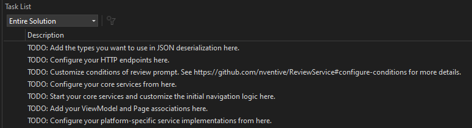

# Uno Platform Application Template

  

This is a mobile app project template using [Uno Platform](https://github.com/unoplatform/uno) and the latest .NET practices.

- It uses the MVVM pattern.
- Code is organized by [application layer](doc/Architecture.md#Solution-Structure).
- It comes with [dependency injection](doc/DependencyInjection.md).
- There are built-in [logs](doc/Logging.md) and [diagnostic tools](doc/Diagnostics.md).
- There is scaffolding code showing sample features.
  When you run as-is, you get a _Dad Jokes_ application.

## Preview
From left to right: WinUI, iOS, and Android.

> Note that scaling was adjusted to better fit this preview and therefore this image isn't representative of the actual device sizes.

### Diagnostic Tools

## Requirements

Visual Studio 2022 with .Net 7 are required.

This template largely relies on Uno Platform, if you want to make sure you got everything installed correctly on your machine, we encourage you to use `uno-check`, the documentation is available [here](https://platform.uno/docs/articles/uno-check.html)

> 💡 It's also possible to use this template for a pure WinUI application, without any mobile aspect.
> All you would have to do is remove the `.Mobile` csproj from the generated solution.

## Getting Started

We use `dotnet` project templates to easily create new projects. It simplifies the **project renaming** and supports **conditional inclusions**.

### Generate a new project

1. Install the template using this command.
   
   `dotnet new install NV.Templates.Mobile`

1. To run the template and create a new project, run the following command in the folder that will contain the new project.
    
    `dotnet new nv-mobile -n MyProjectName`
    
    > ⚠ The use of periods (`.`) in the project name is not supported and may result in compilation issues later on.

   > 💡 If all your projects are regrouped in a folder like `C:\Repos`, you want to be in that folder.
   > The command would generate all the project files under `C:\Repos\MyProjectName`.

   The following options are available when running the command.

   - To get help: `dotnet new nv-mobile -h`

### Next Steps

1. Open the `README.md` and complete the documentation TODOs.
1. Open the solution file from the generated folder using Visual Studio. 

   It's located at `MyProjectName/src/MyProjectName.sln`.

1. In Visual Studio, go to the **VIEW** menu and open the **Task List** to get hints on next steps.
   
   This template comes with several pointers on what you're most likely to change next.
   
   

## Architecture and Recipes
This repository provides documentation on different topics under the [doc](doc/) folder.

### Architecture

The software architecture of the application is documented in the [Architecture](doc/Architecture.md) document.

### Summary of Recipes
| Topic | Recipe/Implementation |
|-|-|
UI Framework | [WinUI](https://learn.microsoft.com/en-us/windows/apps/winui/) [Uno Platform](https://platform.uno/)
[MVVM](doc/Architecture.md#mvvm---viewmodels) | [Chinook.DynamicMvvm](https://github.com/nventive/Chinook.DynamicMvvm)
[Dependency Injection](doc/DependencyInjection.md) | [Microsoft.Extensions.Hosting](https://www.nuget.org/packages/Microsoft.Extensions.Hosting) [Microsoft.Extensions.DependencyInjection](https://learn.microsoft.com/en-us/dotnet/api/microsoft.extensions.dependencyinjection)
[Configuration](doc/Configuration.md) | [Microsoft.Extensions.Configuration](https://learn.microsoft.com/en-us/dotnet/api/microsoft.extensions.configuration)
[Runtime Environments](doc/Environments.md) | [Microsoft.Extensions.Configuration](https://learn.microsoft.com/en-us/dotnet/api/microsoft.extensions.configuration)
Design System | [Uno.Material](https://platform.uno/docs/articles/external/uno.themes/doc/material-getting-started.html) [Material Design](https://m3.material.io/)
[HTTP](doc/HTTP.md) | [Refit](https://github.com/reactiveui/refit) [Microsoft.Extensions.Http](https://learn.microsoft.com/en-us/dotnet/api/microsoft.extensions.http)
[Async Data Loading](doc/DataLoading.md) | [Chinook.DataLoader](https://github.com/nventive/Chinook.DataLoader)
[Logging](doc/Logging.md) | [Serilog](https://serilog.net/) [Microsoft.Extensions.Logging](https://learn.microsoft.com/en-us/dotnet/api/microsoft.extensions.logging)
[Testing](doc/Testing.md) | [xUnit](https://github.com/xunit/xunit)
[Serialization](doc/Serialization.md) | [System.Text.Json](https://docs.microsoft.com/en-us/dotnet/api/system.text.json)
[Localization](doc/Localization.md) | [Microsoft.Extensions.Localization](https://learn.microsoft.com/en-us/dotnet/api/microsoft.extensions.localization)
[Navigation](doc/Architecture.md#navigation) | [Chinook.Navigation](https://github.com/nventive/Chinook.Navigation) [Chinook.BackButtonManager](https://github.com/nventive/Chinook.BackButtonManager)
[Validation](doc/Validation.md) | [FluentValidation](https://fluentvalidation.net/)
[App Reviews](doc/Reviews.md) | [ReviewService](https://github.com/nventive/ReviewService)

## Debugging or Testing the Template
Here's how to install the template directly from the code, in the case that you want to modify it and would like to test your changes.

### Installing the template

1. Uninstall the template from nuget.org (if applicable).
   - `dotnet new uninstall NV.Templates.Mobile`

1. Clone this repository on your machine.
1. Open a command prompt at the root of the cloned repository.
1. Run the following command.

    - `dotnet new install ./`

[Read this for more information on custom templates](https://docs.microsoft.com/en-us/dotnet/core/tools/custom-templates).

### Uninstalling the template
1. Open a command prompt at the root of the cloned repository. 
1. Run the following command.

    - `dotnet new uninstall ./`

## Changelog

Please consult the [CHANGELOG](CHANGELOG.md) for more information about the version history.

## License

This project is licensed under the Apache 2.0 license. See the [LICENSE](LICENSE) for details.

## Contributing

Please read [CONTRIBUTING](CONTRIBUTING.md) for details on the process for contributing to this project.

Be mindful of our [Code of Conduct](CODE_OF_CONDUCT.md).
