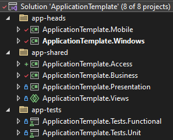

# Software Architecture

## Context

_[Insert context description here]_

_[Create this diagram from the [architecture file](diagrams/architecture.drawio) (context tab) using [Draw.io](https://www.draw.io/)]_

## Functional Overview

This is a summary of the functionalities available to the user.

_[Insert list of functionalities here]_

## Application Structure

_[Insert structure description here]_

_[Create this diagram from the [architecture file](diagrams/architecture.drawio) (structure tab) using [Draw.io](https://www.draw.io/)]_

## Solution Structure

The application solution is divided in 3 main areas.

- `app-heads` contains the _runnable_ heads.
- `app-tests` contains the tests.
- `app-shared` contains the shared code used by the heads and the tests.
  - It's divided per application layer.
  - You can only put platform-specific code (things like `#if __IOS__`) in the Views layer.
  The other layers are `.Net Standard 2.0` libraries that are platform agnostic.

### Access (DAL)
The _data access layer_ is where you would put external dependencies such as API clients and local storage.
Classes providing data should be suffixed with `Repository`.
This is where you put serializable entities.
The associated `csproj` is named `Access` (and not `DataAccess`) so that it shows as the first element alphabetically.
The root namespace is however configured to be `DataAccess`.

### Business
The business layer is where you put your business services and entities that manipulate data from the data access layer.
Classes providing business services should be suffixed with `Service`.
Entities from the business layer are usually immutable and they don't need to be serializable.

### Presentation
The presentation layer implements the user experience (UX).
It contains all the ViewModels, navigation, dialogs, and most of the configuration.

### View
The view layer implements the user interface (UI).
It contains all the XAML, converters, templates, styles, assets, and other UI resources.
This layer also contains platform-specific implementations of services.
For that reason, it also contains a good portion of the configuration.

# Technical Overview

## General
Topics that apply to the whole application.

### Startup
This application uses startup classes to set itself up by doing the following:
- Select the **environment**.
- Select the **configuration** options based on that environment.
- **Register** the services in the dependency injection container.
- **Start** the services and do the initial **navigation**.

This application uses 2 startup classes:
- `Startup` is used to setup the Uno application (WinUI, Android, iOS).
   It is invoked from App.xaml.cs, which is the entry point of the Uno application.
- `CoreStartup` is used to setup the UI-independant services of the application.
   It allows to have a functional app code without any UI, which is useful for testing.

`CoreStartup` is used by the `Startup` class and by automated tests.

See [Startup.md](Startup.md) for more details.

### Dependency Injection
This application is designed to use dependency injection (DI) to manage dependencies between components.

See [DependencyInjection.md](DependencyInjection.md) for more details.

### Diagnostics
This application contains several built-in diagnostic tools. Most of them are configurable and can be can be used in release builds, which allows better support for production issues.

See [Diagnostics.md](Diagnostics.md) for more details.

### Logging

This application contains a built-in logging system that can be used to log messages to the debugger's console, to the native consoles, or to a file.

Note that most of the nventive recipes (such as the Chinook packages) provide logs messages when configured.
e.g. The application is configured to log messages on each ViewModel command execution.

See [Logging.md](Logging.md) for more details.

### Testing
The architecture of application was designed with automated testing in mind.
Automated testing explains why the application is divided in layers that are not multi-targeted.
> i.e. The Access, Business, and Presentation libs target only .net8.0, and **not** .net8.0-ios nor .net8.0-android.

It also explains the separation of `Startup` and `CoreStartup`. `CoreStartup` can setup all the services that are non-UI dependent which can then be used to run simulations of the application using ViewModels that aren't attached to any UI.

See [Testing.md](Testing.md) for more details.

## Access (DAL)
Data access services (also referred to as _repositories_) are always declared using an interface and implemented in a separate class. These interfaces are meant to be used from the business layer.

### HTTP Requests

See [HTTP.md](HTTP.md) for more details.

### Caching

Although it isn't used at the moment, this application could easily use the [SimpleCacheHandler](https://github.com/nventive/MallardMessageHandlers#simplecachehandler) from [MallardMessageHandlers](https://github.com/nventive/MallardMessageHandlers) to cache HTTP requests.

### Local Storage

This applications uses [Nventive.Persistence](https://github.com/nventive/Nventive.Persistence) to store data locally.

Sensitive data is stored using the `KeychainSettingsStorange` and `KeyStoreSettingsStorage` classes.

### JSON Serialization

See [Serialization.md](Serialization.md) for more details.

### Authentication

This application uses [AuthenticationTokenHandler](https://github.com/nventive/MallardMessageHandlers#authenticationtokenhandler) from [MallardMessageHandlers](https://github.com/nventive/MallardMessageHandlers) to authorize HTTP requests and automatically refresh authentication tokens.

## Business
Business services are always declared using an interface and implemented in a separate class. These interfaces are meant to be used from the presentation layer and sometimes by other business services.

### Observable Collections

This application uses [DynamicData](https://github.com/reactivemarbles/DynamicData) to expose observable lists from business services. These can then be used in the presentation layer to create ViewModels that are automatically disposed when their associated items are removed from the list.

## Presentation

### MVVM - ViewModels
This application uses [Chinook.DynamicMvvm](https://github.com/nventive/Chinook.DynamicMvvm) to implement the MVVM pattern. The `ViewModel` class is used as a base class for all ViewModels.

All classes inheriting from `ViewModel` should be suffixed with `"ViewModel"`.

### Navigation
This application uses [Chinook.Navigation](https://github.com/nventive/Chinook.Navigation) for app navigation. The navigation deals with which _PageViewModel_ is currently active.

This application uses bottom tab navigation and modals, and therefore uses **Sections Navigation**.

ViewModels representing pages should be suffixed with `"PageViewModel"`.

#### Native Back Navigation
This application uses [Chinook.BackButtonManager](https://github.com/nventive/Chinook.BackButtonManager) to deal with the native back navigation using platform-agnostic abstractions.

### Dialogs

This application uses [MessageDialogService](https://github.com/nventive/MessageDialogService) to show dialogs from the presentation layer.

### Async Data Loading

This application uses [Chinook.DataLoader](https://github.com/nventive/Chinook.DataLoader) to load data asynchronously from the presentation layer. This ties to the usage of `DataLoaderView` in the View layer and allows to present a loading state while data is being loaded. It also allows to handle errors and empty states.

### Localization

This application uses [`IStringLocalizer`](https://learn.microsoft.com/en-us/dotnet/api/microsoft.extensions.localization.istringlocalizer) from [Microsoft.Extensions.Localization](https://www.nuget.org/packages/Microsoft.Extensions.Localization) to deal with the localization of strings into multiple languages.

See [Localization.md](Localization.md) for more details.

### Validation

This application uses [FluentValidation](https://www.nuget.org/packages/FluentValidation/) to implement validation rules of input forms. It leverages [some extensions from Chinook.DynamicMvvm](https://github.com/nventive/Chinook.DynamicMvvm#add-validation-using-fluentvalidations) to ease the implementation.

See [Validation.md](Validation.md) for more details.

### Analytics
This application has a built-in analytics base that can be used to track events and errors with potentially any analytics service (e.g. AppCenter, Firebase, Segment, etc.). This base is built around the [IAnalyticsSink](../src/app/ApplicationTemplate.Presentation/Framework/Analytics/IAnalyticsSink.cs) interface.

See [DefaultAnalytics.md](DefaultAnalytics.md) for more details.

## View

### UI Framework

This applications uses [WinUI](https://learn.microsoft.com/en-us/windows/apps/winui/) and [Uno Platform](https://platform.uno/) as the UI framework. All the UI is implemented using XAML.

### Platform Specific Code

This application shares its UI code across all its platforms, but some platform-specific code is used to implement some services. This is done using preprocessor directives such as the following:
- `#if __IOS__`
- `#if __ANDROID__`
- `#if __MOBILE__`
- `#if __WINDOWS__`

Some configuration code is also specific to each platform.

See [PlatformSpecifics.md](PlatformSpecifics.md) for more details.

### Design System

This application uses resources from [Uno.Themes](https://github.com/unoplatform/Uno.Themes). More specifically, it uses the **Uno.Material** theme, which is based on Material Design.

Resources from **Uno.Material** are used for the following:
- Color system
- Typography (TextBlock styles)
- Controls styles

### Extended Splash Screen

This application uses [ExtendedSplashScreen](https://github.com/nventive/ExtendedSplashScreen) to display a loading indicator while the application is loading. The extended splash screen is dismissed once the first page of the app has been navigated to.

### Reusable UI Components

This applications uses UI components from a few packages.
- [Nventive.View](https://github.com/nventive/Nventive.View)
  - Converters
  - Extensions (attached properties)
  - Controls (such as SwipeRefresh and PathControl)
- [Uno.Toolkit](https://github.com/unoplatform/uno.toolkit.ui/)
  - Controls (such as Chips, SafeArea)
- [Uno.Themes](https://github.com/unoplatform/Uno.Themes)
  - Material styles for controls
